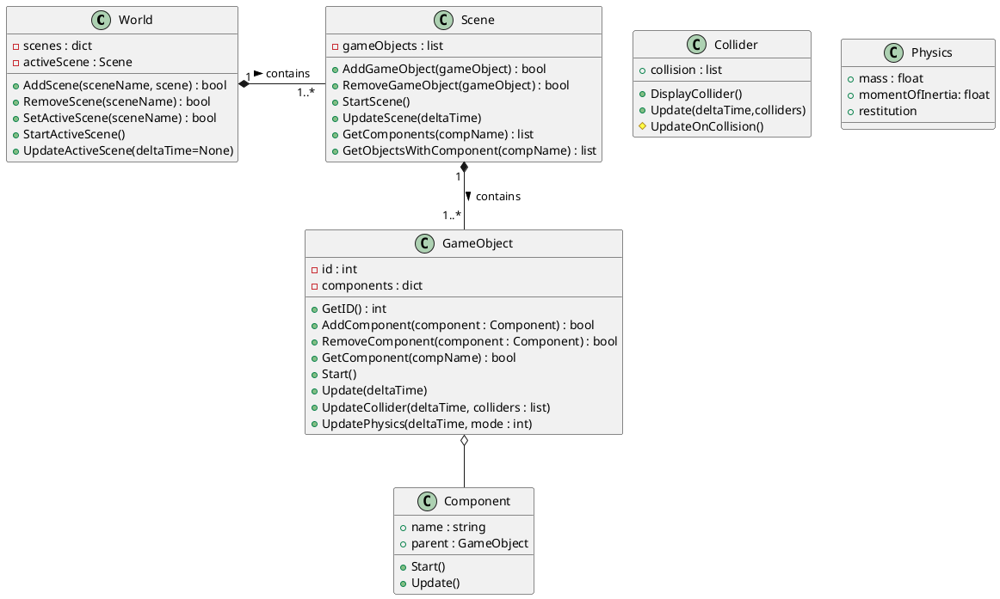

# Bouncy-Balls
## UML: Core Engine Diagram

```plantuml
@startuml
    skinparam backgroundColor transparent

    class World{
        {field} - scenes : dict
        {field} - activeScene : Scene
        {method} + AddScene(sceneName, scene) : bool
        {method} + RemoveScene(sceneName) : bool
        {method} + SetActiveScene(sceneName) : bool
        {method} + StartActiveScene()
        {method} + UpdateActiveScene(deltaTime=None)
    }
    class Scene{
        {field} - gameObjects : list
        {method} + AddGameObject(gameObject) : bool
        {method} + RemoveGameObject(gameObject) : bool
        {method} + StartScene()
        {method} + UpdateScene(deltaTime)
        {method} + GetComponents(compName) : list
        {method} + GetObjectsWithComponent(compName) : list
    }

    class GameObject{
        {field} - id : int
        {field} - components : dict
        {method} + GetID() : int
        {method} + AddComponent(component : Component) : bool
        {method} + RemoveComponent(component : Component) : bool
        {method} + GetComponent(compName) : bool
        {method} + Start()
        {method} + Update(deltaTime)
        {method} + UpdateCollider(deltaTime, colliders : list)
        {method} + UpdatePhysics(deltaTime, mode : int)
    }

    class Component{
        {field} + name : string
        {field} + parent : GameObject
        {method} + Start()
        {method} + Update()
    }

    class Collider{
        {field} + collision : list
        {method} + DisplayCollider()
        {method} + Update(deltaTime,colliders)
        {method} # UpdateOnCollision()
    }

    class Physics{
        {field} + mass : float
        {field} + momentOfInertia: float
        {field} + restitution
        {field} 
        {field}
        {field}
    }

    World "1 " *--r "1..* " Scene : contains >
    Scene "1 " *-- "1..* " GameObject : contains >
    GameObject o-- Component

@enduml
```