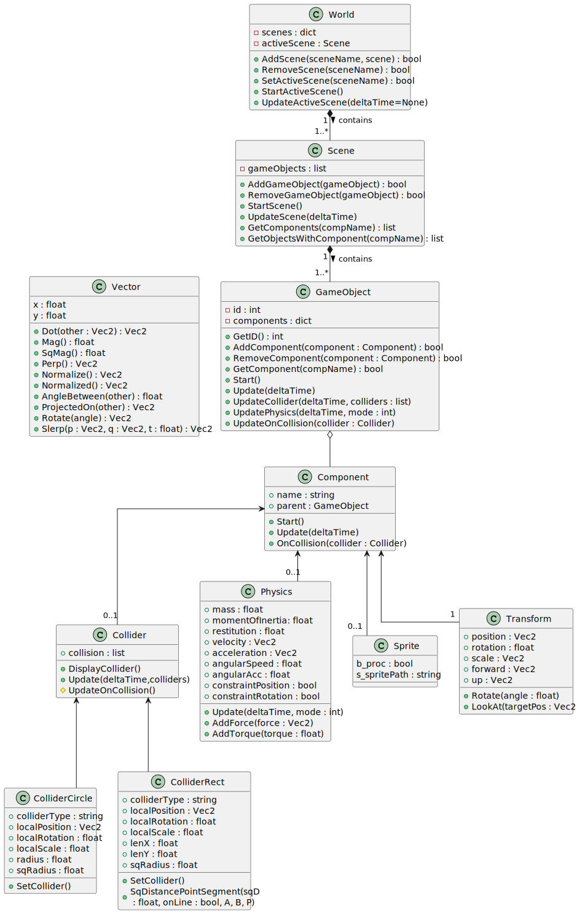

# Bouncy-Balls

## The Core Engine

### UML: Core Engine Diagram



### The World

The World is a container that stores all the scenes in a dictionary by their name.  
Scenes can be added with world.AddScene(sceneName,scene) and removed with world.RemoveScene(sceneName). There is always one active scene which can be set with the world.SetActiveScene(sceneName) function and is the scene that is displayed and worked on.<br>
The world gives the command for initializing the scene with world.StartActiveScene() and updating it each frame with world.UpdateActiveScene(). The UpdateActiveScene function can take in an optional parameter, deltaTime.<br>
DeltaTime (in mathematical notation: &Delta;t) is the time that passes between one frame and the next. If there are 60 frames per second, the deltaTime each frame will be 1/60, or 16ms. Passing in a fixed deltaTime will ignore the actual time between frames and always work with the given value. This is mostly relevant for the physics engine, where the distance objects move is based on deltaTime, based on numerical methods such as Euler or Verlet Integration.<br>

><font color="lightblue">AddScene(sceneName,scene) </font>: Add a scene along with its name to find it later again<br>
<font color="lightblue">RemoveScene(sceneName) </font>: Removes the scene by its name from the worlds dictionary<br>
<font color="lightblue">SetActiveScene(sceneName) </font>: Sets the scene with the matching name to the active scene.<br>
<font color="lightblue">StartActiveScene() </font>: Tell the scene to initialize all its GameObjects<br>
<font color="lightblue">StartUpdateScene(deltaTime = None) </font>: Tell the scene to update all its GameObjects<br>

### The Scene

The Scene is another container, this time for GameObjects, with some additional functionality compared to the world. Each scene can be thought of as more or less a seperate level of a game, although the start menu or level selector can be their own seperate scenes too.<br>
GameObjects can be added to and removed from the scenes list with the scene.AddGameObject(gameObject) and scene.RemoveGameObject(gameObject) functions. When a GameObject is added to the scene, it receives an ID from the scene, which is just a counter from to the scene class, so GameObjects across different scenes will never have the same ID.<br>
The scene can be queried for GameObjects with components or the components from the GameObjects themselves. This means, for example, if you want to collect every collider in the scene, you can call scene.GetComponents(compName) or scene.GetObjectsWithComponent(compName) to get a list of all the colliders or objects with colliders.<br>
Finally, the scene has a start and update function which get called by the world and never by anything else. The Update function is special in that it first updates all the generic components from all its game objects, then the scenes collider detection, then the scenes physics response and finally draws the objects to the screen. Seperating these steps through the list of GameObjects is important for more accurate and realistic physics.<br>

><font color="lightblue"> AddGameObject(gameObject) </font>: Adds the GameObject to the scenes list<br>
<font color="lightblue">RemoveGameObject(gameObject) </font>: Removes the GameObject from the scenes list<br>
<font color="lightblue">GetComponents(compName) </font>: Returns a list of all the components with the matching component name from the scenes list of GameObjects<br>
<font color="lightblue">GetObjectsWithComponent(compName) </font>: Returns a list of all GameObjects that have a component with the maching component name from the scenes list of GameObjects<br>

### GameObject

GameObjects are the basis of the game engine. Everything that exists in the game is a GameObject, where the individual GameObjects can be modified by using components and their respective variables. A GameObject is once again just a container, this time for Components, with additional functionality. Each GameObject holds a dictionary of its components, by the component.name variable, as well as an individual ID, assigned to it by its parent scene. Accessing the ID is done via the GameObject.GetID() function.<br>
Only one component of each type can be assigned to a single GameObject at any given time so that there is no risk of conflicting processes. This means a GameObject can only have one collider and one transform etc. never two or more. Adding a component is as simple as calling the GameObject.AddComponent(component) function, where the object makes sure it doesn't already have a component under that name and then enters it into its dictionary. Removing a component is done in the same way with the GameObject.RemoveComponent(component) function. The Transform component is automatically added to every GameObject.<br>
A very important feature is accessing the components of a GameObject. This is done using the GameObject.GetComponent(compName) function, which returns the component if it exists. For example, to get the position of the object, the function GameObject.GetComponent("Transform").position is used, or more commonly, if the position is needed inside of another component of the same object, it uses the expression self.parent.GetComponent("Transform").position, where self.parent references the GameObject the component is a part of.<br>
The start and update functions are responsible for calling the start and update functions of every component in its dictionary and are used only by the scene.<br>


> <font color="lightblue"> GetID() </font>: Returns the unique ID of the GameObject<br>
<font color="lightblue"> AddComponent(component) </font>: Adds the component to the objects dictionary<br>
<font color="lightblue"> RemoveComponent(component) </font>: Remove the component from the objects dictionary<br>
<font color="lightblue"> GetComponent(compName) </font>: Returns the component with the matching name if it exists in the dictionary<br>

### Component

The component class is a generic class for all other components, which inherit from the Component class. All components have a few things in common: They all have a name and parent variable and a Start, Update and OnCollision function.<br>
The name is unique to each component class and is used to locate it throughout the code. For example, every transform component has the name "Transform", which e.g. gets read by the GameObjects GetComponent() function.<br>
The parent variable is initialized to None when a component is created but gets assigned to the GameObject it is being added to during the AddComponent() process. This means that the component cannot access its parent in the \_\_init\_\_() function, but can be in the Start() and Update() functions. The initializer should thus only set up the main variables that are either passed during the creation of the component or don't depend on outside information. The usage of the parent variable is key to the component system in the engine. Using self.parent for its GameObject or otherComponent.parent for the other components GameObject will give access to the respective GameObject, which opens up access to all of its components. Taking the same example from the GameObject description, using self.parent.GetComponent("Transform").position will get you the position of the GameObject that the current component is a part of, no matter which component the function call is in. In the example below, we create a component Foo that gets assigned a target GameObject, and set our own position to the position of the target.<br>
Additionally, every component has the OnCollision() function by default, though it doesn't do anything. The OnCollision() function is a function that automatically gets called if the gameObject collided with something. If you want custom functionality every time a collision occurs, you can add the OnCollision() function and create the custom behavior there. Note that the function takes in a collider component as an argument. Accessing the GameObject that our own collided with can be done the same way as in the update function with collider.parent.

```python
import Component
class Foo(Component.Component):
    def __init__(self, target):
        self.name = "Foo"
        self.parent = None
    
        self.target = target
        self.hit = False

    def Start(self):
        pass

    def Update(self, deltaTime):
        self.parent.GetComponet("Transform").position = self.target.parent.GetComponent("Transform").position

    def OnCollision(self, collider):
        print("Collided with {collider.parent}")
```