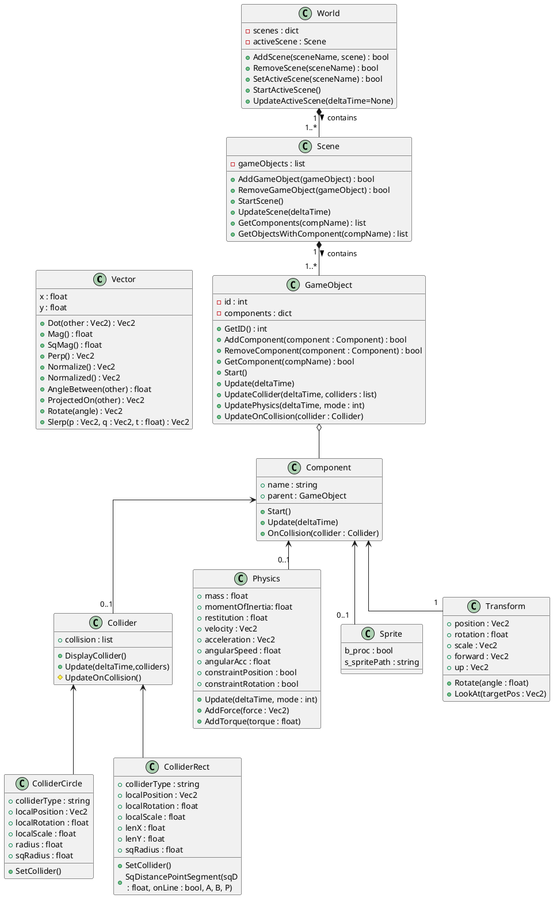

```plantuml
@startuml
    skinparam backgroundColor white
    skinparam linetype ortho
    skinparam ranksep 50

    class Vector{
        {field} x : float
        {field} y : float
        {method} + Dot(other : Vec2) : Vec2
        {method} + Mag() : float
        {method} + SqMag() : float
        {method} + Perp() : Vec2
        {method} + Normalize() : Vec2
        {method} + Normalized() : Vec2
        {method} + AngleBetween(other) : float
        {method} + ProjectedOn(other) : Vec2
        {method} + Rotate(angle) : Vec2
        {method} + Slerp(p : Vec2, q : Vec2, t : float) : Vec2
    }
    class World{
        {field} - scenes : dict
        {field} - activeScene : Scene
        {method} + AddScene(sceneName, scene) : bool
        {method} + RemoveScene(sceneName) : bool
        {method} + SetActiveScene(sceneName) : bool
        {method} + StartActiveScene()
        {method} + UpdateActiveScene(deltaTime=None)
    }
    class Scene{
        {field} - gameObjects : list
        {method} + AddGameObject(gameObject) : bool
        {method} + RemoveGameObject(gameObject) : bool
        {method} + StartScene()
        {method} + UpdateScene(deltaTime)
        {method} + GetComponents(compName) : list
        {method} + GetObjectsWithComponent(compName) : list
    }

    class GameObject{
        {field} - id : int
        {field} - components : dict
        {method} + GetID() : int
        {method} + AddComponent(component : Component) : bool
        {method} + RemoveComponent(component : Component) : bool
        {method} + GetComponent(compName) : bool
        {method} + Start()
        {method} + Update(deltaTime)
        {method} + UpdateCollider(deltaTime, colliders : list)
        {method} + UpdatePhysics(deltaTime, mode : int)
        {method} + UpdateOnCollision(collider : Collider)
    }

    class Component{
        {field} + name : string
        {field} + parent : GameObject
        {method} + Start()
        {method} + Update(deltaTime)
        {method} + OnCollision(collider : Collider)
    }

    class Collider{
        {field} + collision : list
        {method} + DisplayCollider()
        {method} + Update(deltaTime,colliders)
        {method} # UpdateOnCollision()
    }

    together{
    class ColliderRect{
        {field} + colliderType : string
        {field} + localPosition : Vec2
        {field} + localRotation : float
        {field} + localScale : float
        {field} + lenX : float
        {field} + lenY : float
        {field} + sqRadius : float
        {method} + SetCollider()
        {method} + SqDistancePointSegment(sqD\n : float, onLine : bool, A, B, P)
    }
    
    class ColliderCircle{
        {field} + colliderType : string
        {field} + localPosition : Vec2
        {field} + localRotation : float
        {field} + localScale : float
        {field} + radius : float
        {field} + sqRadius : float
        {method} + SetCollider()
    }
    }

    class Physics{
        {field} + mass : float
        {field} + momentOfInertia: float
        {field} + restitution : float
        {field} + velocity : Vec2
        {field} + acceleration : Vec2
        {field} + angularSpeed : float
        {field} + angularAcc : float
        {field} + constraintPosition : bool
        {field} + constraintRotation : bool
        {method} + Update(deltaTime, mode : int)
        {method} + AddForce(force : Vec2)
        {method} + AddTorque(torque : float)
    }

    class Sprite{
        {field} b_proc : bool
        {field} s_spritePath : string
    }

    class Transform{
        {field} + position : Vec2
        {field} + rotation : float
        {field} + scale : Vec2
        {field} + forward : Vec2
        {field} + up : Vec2
        {method} + Rotate(angle : float)
        {method} + LookAt(targetPos : Vec2)
    }


    World "1 " *-- "1..* " Scene : contains >
    Scene "1 " *-- "1..* " GameObject : contains >
    GameObject o-- Component
    GameObject -l[hidden] Vector
    Component <-- "0..1" Collider
    Component <-- "0..1" Physics
    Component <-- "0..1" Sprite
    Component <-- "1" Transform

    Collider <--d ColliderRect
    Collider <--d ColliderCircle

@enduml
```